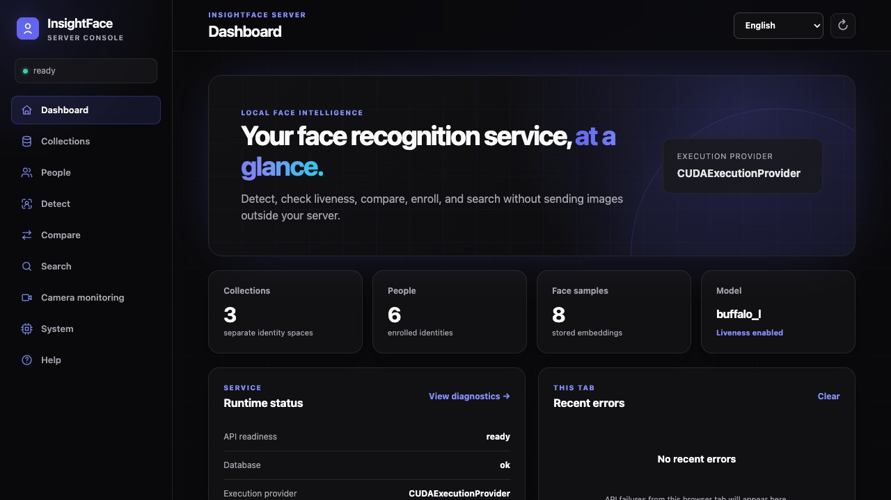
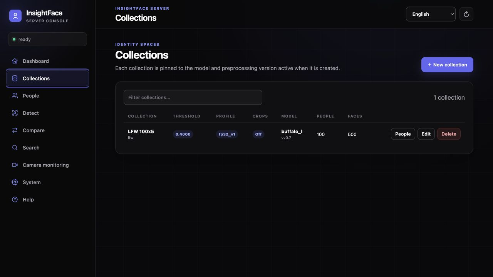
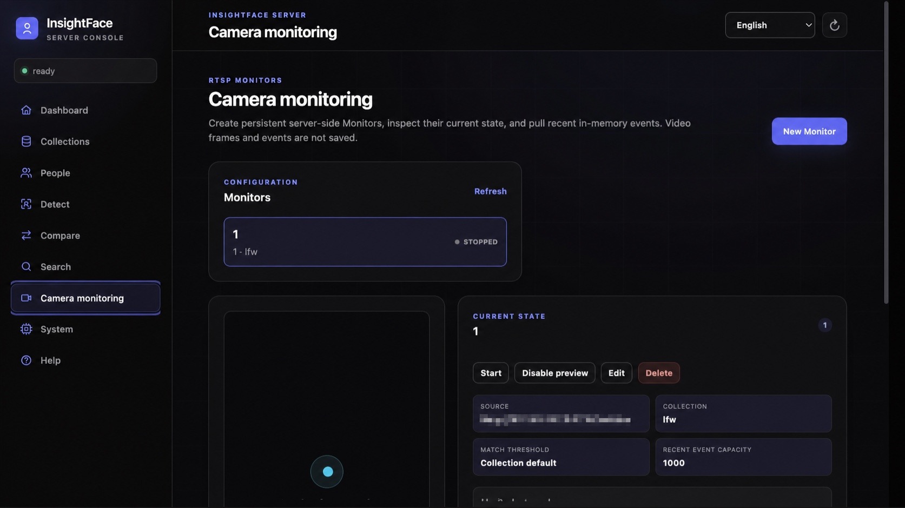

# InsightFace Server

**Idiomas:** [English](README.md) · [中文](README.zh-CN.md) · [日本語](README.ja.md) · [Deutsch](README.de.md) · Español · [Français](README.fr.md) · [Русский](README.ru.md) · [Português](README.pt.md) · [한국어](README.ko.md)

> **Una GPU. 50M+ de vectores faciales. Búsqueda ultrarrápida con cuantización INT8 de características y sin pérdida material de precisión.**

**Servidor de reconocimiento facial autohospedado con Web UI, una REST API
directa, SQLite e inferencia local por CPU o GPU NVIDIA en un solo contenedor.**

```text
subir una imagen -> detectar, realizar una prueba de vida, comparar, registrar o buscar
```

> **Licencia del modelo:** los modelos públicos preentrenados de InsightFace
> suelen estar disponibles solo para investigación no comercial. El uso
> comercial requiere una autorización independiente de
> [InsightFace](https://www.insightface.ai).

InsightFace Server es una alternativa más sencilla y centrada en la privacidad
a AWS Rekognition para flujos habituales ejecutados en infraestructura propia.
Imágenes, embeddings, modelos e índices pueden permanecer dentro de su red. No
es un reemplazo compatible con AWS y no implementa SigV4, IAM, Region ni
semántica de recursos AWS.

Versión actual: **0.3.1**, Linux x86_64.

| Entorno | Imagen |
| --- | --- |
| CPU | `ghcr.io/deepinsight/insightface-server:0.3.1-cpu` |
| GPU NVIDIA | `ghcr.io/deepinsight/insightface-server:0.3.1-cuda12` |

Las etiquetas móviles `cpu` y `cuda12` identifican la última versión estable de
cada familia. No se usa una etiqueta ambigua `latest`. Consulte
[Maintainer Guide — English](docs/maintainer-guide.md) para la política.

**Novedades y actualización a 0.3.1:** Server y el instalador se ejecutan como root; un único montaje de modelos con escritura sustituye al montaje separado de addons. Compose crea el directorio cuando hace falta, sin configurar UID/GID ni permisos manualmente. Actualice también los archivos Compose y sus overrides, conservando las rutas de modelos, configuración y datos. Consulte los [pasos de actualización](docs/user-guide.es.md#actualizar-a-031).

Desde 0.3.0 se admiten `raccoon_s`, `raccoon_l`, sus manifiestos, prueba de vida opcional con instalación Web e imágenes BMP. Desde esa versión, los resultados API y SDK omiten `model_version`. La prueba de vida permanece desactivada hasta que se habilite.



## Funciones principales

- Detección SCRFD, cinco landmarks, alineación, embeddings ArcFace, L2
  normalization, cosine similarity original y búsqueda exacta 1:N de Person.
- Detección multirresolución con un único NMS combinado y selección
  `largest` o `center_largest`.
- `Collection -> Person -> FaceSample`, Collections vinculadas al modelo,
  registro de varias imágenes con éxito parcial, metadata y razones claras.
- `review_mode` de registro: `off`, `standard` o `strict`; embeddings
  precalculados opcionales mediante `external_trusted`.
- Búsqueda GPU exacta con almacenamiento vectorial FP32, FP16, BF16 e INT8.
- Web UI multilingüe para Panel, Collections, Personas, Detect, Compare,
  Search, monitorización RTSP, System y Help.
- 31 operaciones REST snake_case bajo `/v1`, incluido `/v1/embeddings`
  protegido, más un SDK Python ligero y tipado.
- Monitors RTSP persistentes del servidor, eventos acotados en memoria,
  múltiples clientes y `preview.mjpeg` opcional; cerrar el navegador no detiene
  el monitor.
- SQLite como fuente persistente, índices exactos reconstruibles en memoria,
  un único montaje de modelos con escritura y un directorio de configuración escribible, `/data` persistente, migraciones, health checks y
  validación CUDA estricta sin fallback silencioso a CPU.
- Entrada JPEG, PNG, WebP y BMP; los originales no se conservan por defecto.

La prueba de vida está desactivada por defecto: `inference.addons = []` y `addons.auto_download = []` en `server/config/server.toml`. **Sistema → Detección de vida** descarga y verifica el modelo y guarda la activación para el próximo reinicio manual; reutiliza una copia verificada. El inicio no descarga modelos. Si falta un modelo activado, el inicio se detiene e indica cómo instalarlo. Cada rostro evaluado devuelve los campos principales `status`, `is_live` y `live_score`; solo `input_rejected` añade una explicación para el usuario en `reason`. El modo predeterminado es `normal`; el registro omite la prueba por defecto (`liveness_on_registration = false`). Consulte [configuración, permisos Web y actualización](docs/user-guide.es.md#addon-opcional-de-prueba-de-vida).

### Rendimiento de búsqueda GPU en RTX 5090

En una NVIDIA GeForce RTX 5090 (32.607 MiB), el índice plano exacto CUDA nativo
almacenó hasta **58,9M vectores de imagen de 512 dimensiones con INT8**.

| Tipo de datos GPU | Máximo de vectores de imagen | 10M Top-5 p50 | 10M QPS serial |
| --- | ---: | ---: | ---: |
| FP32 | 15,8M | 12,84 ms | 77,85 |
| FP16 | 30,7M | 6,83 ms | 146,32 |
| BF16 | 30,7M | 6,83 ms | 146,33 |
| INT8 | **58,9M** | **3,84 ms** | **260,81** |

INT8 obtuvo 3,73 veces la capacidad medida y 3,35 veces el rendimiento Top-5
de FP32 sobre 10M. Son mediciones solo de GPU en la misma RTX 5090 con Driver
580.105.08 y CUDA 12.9. La capacidad es el límite aislado del índice nativo sin
modelos ONNX cargados ni carga del Server. La velocidad usa exactamente 10M
vectores de imagen, barrido exacto Top-5 residente en GPU, una consulta en
curso, 10 calentamientos y 100 mediciones. La búsqueda es exacta dentro de cada
representación almacenada; la cuantización puede cambiar scores frente a FP32.
Producción debe reservar VRAM para modelos, requests, concurrencia,
reconstrucciones del índice y el allocator.

### Precisión MR-ALL multirracial de ICCV21-MFR

Evaluamos los perfiles de búsqueda nativos sobre el conjunto multirracial (MR)
de [ICCV21-MFR](../challenges/iccv21-mfr/) con su protocolo MR-ALL 1:1 de todos
los pares y FAR `1e-6`. Todos los perfiles usan los mismos embeddings
`buffalo_l` de 512 dimensiones, normalizados con L2 y extraídos una sola vez
mediante la Server API; solo cambia la representación de almacenamiento y
cálculo de la búsqueda.

| Perfil de búsqueda | MR-ALL con FAR 1e-6 | Umbral cosine | Diferencia frente a FP32 |
| --- | ---: | ---: | ---: |
| FP32 | 91,249107 % | 0,407787 | — |
| FP16 | 91,249197 % | 0,407787 | +0,000090 puntos porcentuales |
| BF16 | 91,248502 % | 0,407787 | -0,000605 puntos porcentuales |
| **INT8** | **91,248005 %** | **0,407739** | **-0,001102 puntos porcentuales** |

**INT8 no presenta una pérdida material de precisión en este benchmark:**
con el redondeo a dos decimales habitual del challenge, FP32 e INT8 obtienen
**91,25 % de MR-ALL**; la diferencia sin redondear es de solo 0,0011 puntos
porcentuales. A la vez, conserva las ventajas mostradas arriba de 3,73 veces la
capacidad medida y 3,35 veces el rendimiento Top-5 sobre 10M. Esta comparación
mide la precisión del almacenamiento y la búsqueda vectorial, no la inferencia
de modelos INT8.





## Inicio rápido

Requisitos:

- Linux x86_64 con Docker Engine y Docker Compose;
- para CUDA, GPU NVIDIA compatible, NVIDIA Driver y NVIDIA Container Toolkit.

El host no necesita Python, OpenCV, ONNX Runtime, CUDA Toolkit ni cuDNN. Las
imágenes públicas no incluyen modelos, datos de clientes, API Keys ni
configuración de producción.

Desde un checkout completo de InsightFace, instale un modelo en
`server/.models`:

Ejecute los comandos desde la raíz del repositorio con `server/config/server.toml` presente. Server y el instalador de modelos se ejecutan como root (`0:0`). Compose crea `server/.models` si falta y lo monta una sola vez con escritura en `/models`. El subdirectorio `addons` se crea al descargar un addon. No hacen falta exportaciones UID/GID ni preparar directorios o permisos manualmente. El arranque normal no descarga modelos; la prueba de vida está desactivada por defecto.

```bash
docker compose -f server/deploy/compose.cpu.yml pull
docker compose -f server/deploy/compose.cpu.yml \
  run --rm models install buffalo_l --accept-license
```

Opcionalmente puede configurar la prueba de vida al instalar el modelo; sustituya el comando de instalación por:

```bash
docker compose -f server/deploy/compose.cpu.yml \
  run --rm models install buffalo_l --accept-license --enable-liveness
```

Server no tiene que estar en ejecución. En una instalación nueva, el siguiente `up -d` activa la prueba de vida; si Server ya está ejecutándose, use `docker compose -f server/deploy/compose.cpu.yml restart server`. `up -d` por sí solo no recarga los ajustes guardados. Para CUDA use `compose.cuda12.yml`.

La herramienta admite los siete paquetes: `buffalo_l`, `buffalo_m`,
`buffalo_s`, `buffalo_sc`, `antelopev2`, `raccoon_s` y `raccoon_l`.
Escribe `manifest.json` y el `MODEL.LICENSE` firmado; `models verify` comprueba
el paquete. Los términos del modelo son independientes de la licencia del
código Server.

Iniciar CPU:

```bash
docker compose -f server/deploy/compose.cpu.yml up -d
curl -fsS http://127.0.0.1:18097/v1/health
```

Iniciar CUDA 12 en su lugar:

```bash
docker compose -f server/deploy/compose.cuda12.yml pull
docker compose -f server/deploy/compose.cuda12.yml \
  run --rm models install buffalo_l --accept-license
docker compose -f server/deploy/compose.cuda12.yml up -d
curl -fsS http://127.0.0.1:18098/v1/health
```

Abra `http://SERVIDOR:18097/` para CPU o `http://SERVIDOR:18098/` para CUDA.
Cree una Collection, registre una Person con una o varias fotos y busque con
otra. Use `docker compose ... down` sin `-v` para conservar el volumen.

Los Compose incluidos desactivan la autenticación por defecto para evaluación
aislada. Antes de exponer el servicio a otras personas o redes:

```bash
export INSIGHTFACE_AUTH_ENABLED=true
export INSIGHTFACE_API_KEY='sustituya-por-un-secreto-aleatorio-largo'
docker compose -f server/deploy/compose.cpu.yml up -d
```

Consulte la [guía para principiantes](docs/user-guide.es.md) para el flujo
completo.

## Compilar desde el código fuente

Puede compilar directamente desde un directorio local con el código fuente
completo, incluso con cambios sin confirmar o sin un directorio `.git`. No es
necesario hacer commits ni subirlos con Git antes de compilar.

Los Dockerfiles copian `server/` y módulos de inferencia seleccionados de
`python-package/insightface/`, por lo que el directorio completo del código fuente es el
contexto de compilación.

CPU:

```bash
make -C server build-cpu
docker compose -f server/deploy/compose.cpu.yml \
  run --rm --pull never models install buffalo_l --accept-license
docker compose -f server/deploy/compose.cpu.yml \
  up -d --no-build --pull never
```

CUDA 12:

```bash
make -C server build-cuda12
docker compose -f server/deploy/compose.cuda12.yml \
  run --rm --pull never models install buffalo_l --accept-license
docker compose -f server/deploy/compose.cuda12.yml \
  up -d --no-build --pull never
```

`--pull never` obliga a usar la imagen local. La compilación aún descarga las
imágenes base y dependencias fijadas; la instalación descarga por separado el
paquete de modelo cuya licencia se aceptó.

## Comportamiento esencial

- Similarity es el coseno original, no una probabilidad. Los thresholds usan
  `0.0..1.0` y el valor predeterminado es `0.4`.
- Una Collection fija el modelo y el embedding contract. Si no coinciden, sigue
  visible pero registro/búsqueda devuelve `collection_model_mismatch`.
- El Detection Profile de inicio se copia a nuevas Collections; después puede
  modificarse de forma independiente para las siguientes peticiones.
- El guardado opcional conserva un bounding-box JPEG crop redimensionado a
  112x112, no el original ni la entrada alineada de reconocimiento; está
  desactivado por defecto.
- Los commits SQLite son autoritativos. El índice se sincroniza antes de una
  respuesta correcta de registro/borrado y se reconstruye tras reiniciar.
- Las respuestas incluyen `x-request-id`; las listas usan cursor firmados y
  opacos.

Los campos exactos, defaults, ciclos de vida y errores están únicamente en la
documentación detallada enlazada a continuación.

## API y SDK

Grupos principales:

- sistema: `/v1/health`, `/v1/system`, `/v1/models`;
- operaciones sin estado: `/v1/detect`, `/v1/compare`, `/v1/embeddings`;
- CRUD de Collection, Person y FaceSample;
- búsqueda de Person en Collection;
- configuración, estado, eventos y vista previa de RTSP Monitor.

La [guía REST API](docs/api.es.md) contiene parámetros, respuestas, errores y
ejemplos. OpenAPI interactivo sigue disponible en `/docs`.

```python
from insightface_server import Client

with Client("http://localhost:18097", api_key=None) as client:
    faces = client.detect("photo.jpg")
    matches = client.search("employees", "unknown.jpg", limit=5)
```

La instalación, entradas, métodos y flujos completos del SDK están en la
[guía de usuario](docs/user-guide.es.md).

## Seguridad

El despliegue incluido usa root con las capabilities predeterminadas de Docker y puede escribir en los montajes de modelos, configuración y datos. El resto del sistema de archivos es de solo lectura y se conserva `no-new-privileges`. Limite el acceso al host y los directorios montados.

Las imágenes faciales y embeddings son datos biométricos. En red, active la
autenticación, termine HTTPS en un proxy inverso fiable, restrinja Docker y los
volúmenes, mantenga deshabilitado CORS amplio y defina copias de seguridad,
retención, borrado, consentimiento y respuesta a incidentes. No registre
imágenes, embeddings, credenciales RTSP ni API Keys.

El Server no incluye TLS, cuentas, RBAC, cloud IAM ni una capa de cumplimiento
legal. La operación y seguridad están en la
[guía de usuario](docs/user-guide.es.md).

## Alcance de la primera fase

No incluye compatibilidad AWS/CompreFace, CUDA 11, Jetson, ARM64, Windows
Container, TensorRT, Kubernetes, Workers distribuidos, eventos Monitor
persistentes o grabación/NVR, deepfake ni análisis demográfico.

## Documentación

- [Guía de usuario](docs/user-guide.es.md) — instalación, configuración,
  modelos, Web UI, SDK, GPU, seguridad, backup y resolución de problemas.
- [Guía REST API](docs/api.es.md) — todos los endpoints, campos, comportamientos,
  resultados, errores, paginación y ejemplos.
- [Maintainer Guide — English](docs/maintainer-guide.md) — arquitectura,
  búsqueda interna, pruebas, contribuciones y releases de contenedor.

GitHub y la ayuda Web UI leen los mismos Markdown localizados; solo cambia la
presentación.

## Licencia

El único punto de entrada de licencias es [LICENSING.md](LICENSING.md). El
código Server y el SDK Python usan MIT License; esta declaración no cubre
archivos ni pesos de modelos, datasets o componentes de terceros. Los modelos
públicos de InsightFace suelen limitarse a investigación no comercial salvo
autorización separada. Licencia comercial: <https://www.insightface.ai>.
